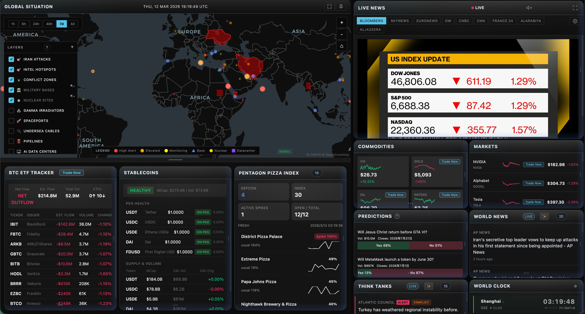

# Global Intel

**Real-time global intelligence dashboard** — AI-powered news aggregation, geopolitical monitoring, and infrastructure tracking in a unified situational awareness interface.

We are committed to building a pure web monitor experience that runs directly in the browser, without desktop app installation, so it does not add extra burden to your computer.

  <a href="https://github.com/pacifica-fi/global-intel"><strong>Repository</strong></a> &nbsp;·&nbsp;
  <a href="https://github.com/pacifica-fi"><strong>Author</strong></a> &nbsp;·&nbsp;
  <a href="https://app.pacifica.fi/agent"><strong>Pacifica AI Agent</strong></a>

---

## Pacifica Integration

Global Intel includes a direct entry to Pacifica trading surfaces inside the dashboard experience.

### Pacifica Links

- Documentation: https://pacifica.gitbook.io/docs/
- Builder Program: https://docs.pacifica.fi/builder-program
- API Documentation: https://docs.pacifica.fi/api-documentation/api
- AI Trading Agent: https://app.pacifica.fi/agent

### Builder Program Contacts

For Builder Program onboarding or integration support:

- Email: ops@pacifica.fi
- Discord: https://discord.gg/pacifica
- Telegram: @PacificaTGPortalBot

### Builder Program Summary

- Builders can earn fees for approved user order flow via builder codes.
- User approval is explicit, revocable at any time, and enforced server-side.
- Builder code support is available across REST and WebSocket order endpoints.
- Current rewards program allocation is up to 10,000,000 points.

## Acknowledgments

Built on [World Monitor](https://github.com/koala73/worldmonitor) by Elie Habib.

## License

This project is licensed under the MIT License.
